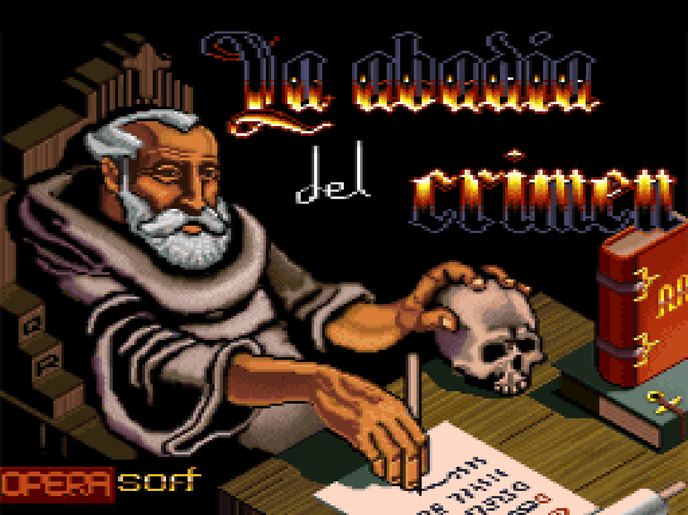
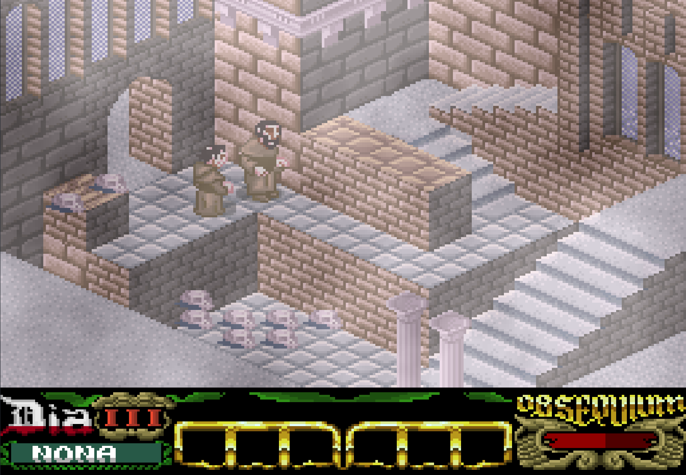
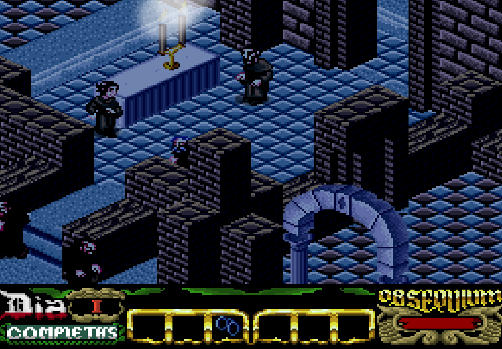
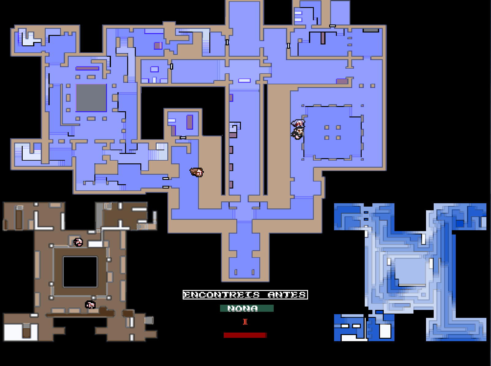
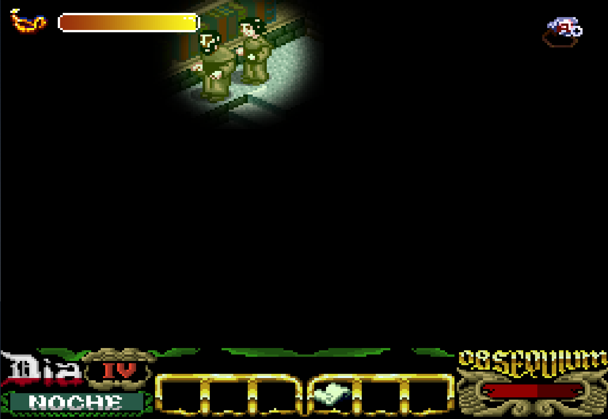

# 🏰 La Abadía del Crimen (Java Remake) – Standalone Edition

▶ Ejecuta: Abadia 2026.exe - para jugar solo con teclado. 
▶ Ejecuta: Abadia 2026 mando xbox.bat - para jugar con mando de xbox

No requiere instalación.

Controles rápidos:
- F11 → pantalla completa
- Z → zoom
- Back + Start → salir

---

Versión modernizada y jugable en sistemas actuales del remake en Java de *La Abadía del Crimen* de Manuel Pazos.

Este proyecto elimina la dependencia de applets y navegadores antiguos, convirtiendo el juego en una aplicación standalone compatible con setups modernos (Playnite, mando Xbox, etc).

---

## ✨ Características

* ✅ Ejecución standalone (sin navegador ni Java plugin)
* ✅ Compatible con sistemas modernos
* ✅ Soporte completo para mando Xbox
* ✅ Pantalla completa (F11)
* ✅ Sistema de zoom (tecla Z)
* ✅ Control totalmente jugable desde sofá

---

## 🎮 Controles

### Teclado (original)

* Flechas → movimiento
* Espacio → acción
* ESC → menú
* Enter → mapa
* Ctrl → acelerar acción
* S / N → decisiones nocturnas
* Z → cambiar nivel de zoom

### 🎥 Cámaras (solo teclado)

* 1 → Ver cámara Abad
* 2 → Ver cámara Severino
* 3 → Ver cámara Malaquías
* 4 → Ver cámara Berengario
* 5 → Ver cámara Jorge
* 6 → Ver cámara Bernardo
* 7 → Ver cámara Adso

---

### 🎮 Mando Xbox

#### Movimiento

* D-Pad → movimiento completo
* Stick izquierdo → izquierda/derecha

#### Acciones

* A → mover Guillermo
* B → mover Adso
* X → acción (Espacio)
* Y → cambiar nivel de zoom (Z)

#### Sistema

* Start → menú (ESC)
* Back → mapa (Enter)
* Back + Start → salir del juego

#### Gameplay

* RB → acelerar (Ctrl)
* L3 → Sí (S)
* R3 → No (N)
* LB → acción especial (Q + R, necesario para completar el juego)

---

🧠 Sobre esta versión

Este proyecto nace de una motivación muy sencilla: esta versión en Java de La Abadía del Crimen, desarrollada por Manuel Pazos, es probablemente la mejor versión del juego que existe.

Introduce una serie de mejoras que hacen la experiencia mucho más accesible y disfrutable respecto al original:

* Posibilidad de guardar y cargar partida
* Mapa completo de la abadía accesible en cualquier momento
* Sistema de cámaras para observar a distintos personajes (Abad, Severino, Berengario, etc.)
* Indicadores adicionales (aceite de la lámpara, estado del Abad, etc.)
* Efectos gráficos como iluminación, sombras y niebla
* Opciones configurables desde el propio juego

El problema es que esta versión estaba pensada para ejecutarse como applet de Java, lo que hoy en día la hace incompatible con navegadores modernos. En la práctica, esto la convertía en una especie de lost media.

La motivación de este proyecto ha sido precisamente evitar eso: poder jugarla cómodamente en un PC moderno, dejarla lista para su uso sin complicaciones y compartirla para que no se pierda.

Para ello, esta adaptación:

* elimina la necesidad de navegador
* evita configuraciones inseguras de Java
* permite ejecución directa como aplicación
* mejora la experiencia con controles modernos (incluyendo mando)

Al mismo tiempo, es también una forma de reconocer y poner en valor el trabajo de Manuel Pazos, así como el de los creadores originales del juego.

---

## 🙌 Créditos

* Juego original: Paco Menéndez y Juan Delcán
* Remake Java: Manuel Pazos
* Standalone + mando + integración: Daniel Turienzo

---

## ⚠️ Nota

Este proyecto es una adaptación técnica para preservar y facilitar el acceso al juego.

Todos los derechos pertenecen a sus autores originales.

